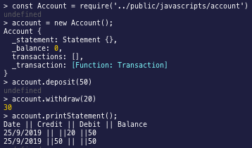

# Techtests


Bank Tech Test:

<strong>Requirements:</strong><br>

You should be able to interact with your code via a REPL like IRB or the JavaScript console. (You don't need to implement a command line interface that takes input from STDIN.)
Deposits, withdrawal.
Account statement (date, amount, balance) printing.
Data can be kept in memory (it doesn't need to be stored to a database or anything).


<strong>Acceptance criteria</strong><br>

- Given a client makes a deposit of 1000 on 10-01-2012
- And a deposit of 2000 on 13-01-2012
- And a withdrawal of 500 on 14-01-2012
- When she prints her bank statement

##Installation

Download the repo to your projects file : 
```
git clone https://github.com/Fentonhaslam/Techtests.git
```
Move to the new directory and install npm

## How to run
First open Node
```
node
```
```
const Account = require('../public/javascripts/account')
```
```
account = new Account();
```
```
account.deposit(50);
```
```
account.withdraw(20);
```
```
account.printStatement();
```
Gives the output on the console: 




<strong> User Stories </strong><br>

As a user 
So I can view my bank balance
I want to view my total bank balance

As a user 
So I can deposit money into my bank
I want to add a number to my balance

As a user
So I can withdraw money from my bank
I want to withdraw money from my available balance

As a user
So I can view my statement
I'd like to see view all my transactions
